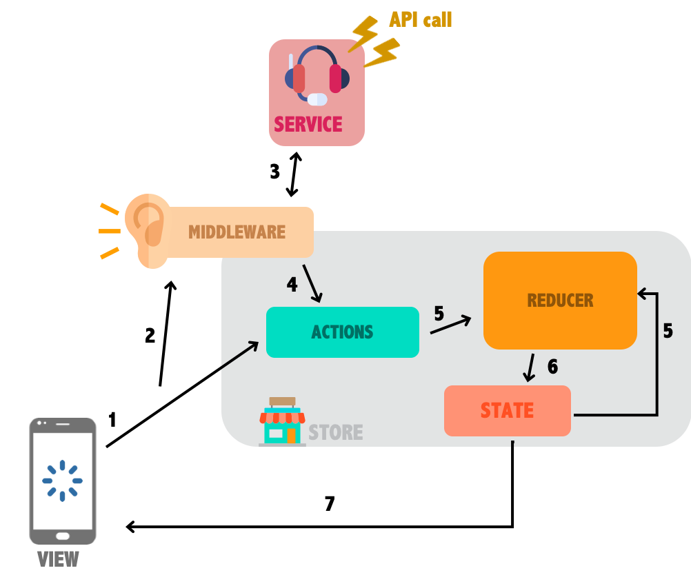

# REDUX STORE

Here you'll find how to manage and create a Redux store using Redux, React-redux, Redux toolkit and Redux-persist.

## Description

The store folder contains everything to manage app global state. It's imported and used as a provider in the `App.js` file.



### index.js

This file declare all store states and their attached reducers. 

- Each reducer need to be declared here : 
```javascript
const rootReducer = combineReducers({
    auth: authReducer, //Here the example reducer you can add yours below
});
```

- If a state needs to be persisted (its value will not be erased when the app is closed), it has to be added in the whitelist in the persistConfig : 
```javascript
const persistConfig = {
    key: 'root',
    whitelist: ['auth'], //Here the example state auth is persisted, you can add yours in this list
    storage: AsyncStorage,
};
```
The rest of the file create and export the store and the persisted values.

### initialState.js

Defines the initial value of the state.

### actions.js

Defines the different actions that can be dispatched to modify the state. 
Thanks to redux toolkit it's possible to add a call to a service in the action to handle asynch calls easily.

### reducers.js

Triggered by an action, a reducer is the function that defines the change applied to the state. 

## Reading and updating a state

Let's see how everything works by the example of a user authentication. 

1. **Define initial auth state variables and their initial values.**

We will need the authentication token retreived from the login API call,
  a loading value to display a loader during the call and an error value in
  case of something go wrong.
```javascript
export const INITIAL_STATE = {
  token: null,
  loading: false,
  error: null,
};

```

2. **Define a login action**

Then we need to define an action in which we will indicate the service
   that need to be called to make the login API call.
```javascript
export const login = createAsyncThunk('auth/login', async (data) => {
  const response = await AuthService.login(data);
  return response.data.token;
});
```

3. **Define reducers**

We need to define 3 reducers : 
- One to set the login value to true (`loginLoading`)
- One to set the token value in case of success (`loginSuccess`)
- One to set the error value in case of error (`loginError`)

```javascript
export const loginLoading = (state) => ({
  ...state,
  token: null,
  loading: true,
  error: null,
});

export const loginSuccess = (state, {payload}) => ({
  ...state,
  token: payload,
  loading: false,
  error: null,
});

export const loginFailure = (state, {payload}) => ({
  ...state,
  token: null,
  loading: false,
  error: payload,
});
```

Then we export the reducers in a slice to pair them with the right actions (the pending, fullfilled and rejected actions are automatically
created by the createAsyncThunk method described above).

```javascript
export const authReducer = createSlice({
  name: 'auth',
  initialState: INITIAL_STATE,
  extraReducers: {
    [login.fulfilled]: loginSuccess,
    [login.rejected]: loginFailure,
    [login.pending]: loginLoading,
  },
}).reducer;
```
 
3. **Dispatch login action**
   
When the user has filled the info, we can send them by dispatching 
the action that we've just created. To do that we can use the `useDispatch` hook like below :
```javascript
 const dispatch = useDispatch();
  const doLogin = useCallback(() => dispatch(login({email, password})), [
    dispatch,
    email,
    password,
  ]);
```
Dispatching the login action will do several steps : 
- Calling the `loginLoading` reducer to change the loading state to true.
- Calling the service like describe in the action
- Calling either the `loginSuccess` either the `loginError` depending on the result received from the service, to updater the 
token state or the error one.
  

  4. **Reading the token value from a component**

We can use all the state values by using the `useSelector` hook like below :
```javascript
  const token = useSelector((state) => state.auth.token);
```
The component will be reload each time the part of the state that he's using have changed.
